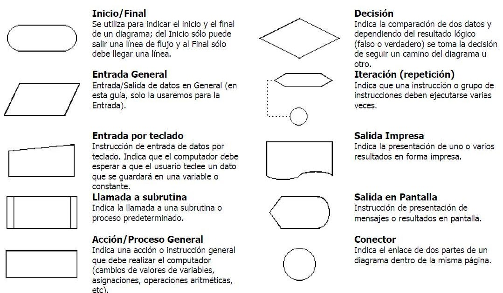
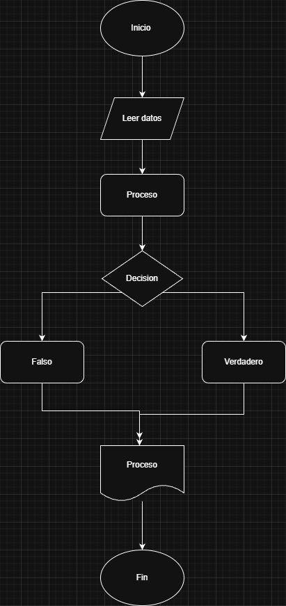

## Actividad 2

### Bitacora:

---

### Diagrama de flujo

---

## Pseudocodigos

### Un acuario necesita determinar cuántos litros o galones de agua caben en un acuario, pero solo dispone de una cinta métrica. Diseña un algoritmo para solucionar el problema.

**Valores de entrada**

|dato|Descripción|
|----|-----------|
|Largo |Largo del tanque en cm |
|Ancho |Ancho del tanque en cm |
|Alto|Alto del tanque en cm    |
|Unidad|Unidad de medida (litro o galón) del volumen total|

**Valores de salida**

|dato|Descripción|
|-|-|
|Vol_L|Volumen total del tanque en litros|
|Vol_G|Volumen total del tanque en litros|

#### pseudocodigo
Inició

mostrar"igrese medidas del tanque"

Leer Largo, Ancho, Alto

Mostrar"ingrese L para litros y G para galones"

Leer Unidad

Volumen= largo*Ancho*Alto

Vol_L= Volumen/1000

 si unidad = "L"

Mostrar Vol_L

si no 
    
vol_G= Vol_L*0.26

fin si 

fin

---

### Realice un algoritmo para determinar cuánto se debe pagar por equis cantidad de lápices considerando que si son 1000 o más el costo es de $85 cada uno; de lo contrario, el precio es de $90. Represéntelo con el pseudocódigo y el diagrama de flujo.

**Valores de entrada**

|dato|Descripción|
|----|-----------|
|CL| cantidad de lápices|
|||

**Valores de salida**

|dato|Descripción|
|-|-|
|PP|cuánto se debe pagar por equis cantidad de lápices |

**Valores intermedios**

|dato|Descripción|
|-|-|
|pre|precio asignado dependiendo de la cantidad|

#### pseudocodigo

inicio

mostrar "Ingresa la cantidad de lápices que comprara"

leer cl

si cl<1000

    pp= cl*90

si no

    pp= cl*85

fin si

Mostra pp

fin

---

### Un almacén de ropa tiene una promoción: por compras superiores a $250 000 se les aplicará un descuento de 15%, de caso contrario, sólo se aplicará un 8% de descuento. Realice un algoritmo para determinar el precio final que debe pagar una persona por comprar en dicho almacén y de cuánto es el descuento que obtendrá. Represéntelo mediante el pseudocódigo y el diagrama de flujo.

**Valores de entrada**

|dato|Descripción|
|-|-|
|VC|Valor de la compra|

**Valor de salida**

|dato|Descripción|
|-|-|
|PF|precio final|

**Valores intermedios**

|dato|Descripción|
|-|-|
|Des|descuento asignado dependiendo el valor total de la compra|

Incio

mostar "ingrese el valor de la compra"

leer VC

si VC>250000

    PF= VC*0.15

si no

    PF=VC*0.08

fin si

Mostrar PF

fin.

----

### Una empresa necesita calcular el ingreso total y el promedio mensual del sueldo de un empleado durante 6 meses. Diseña un algoritmo para solucionar el problema.

**Valores de entrada**

|dato|Descripción|
|----|-----------|
|ID|Identificador del empleado (numérico)|
|S1|Sueldo del mes 1|
|S2|Sueldo del mes 2|
|S3|Sueldo del mes 3|
|S4|Sueldo del mes 4|
|S5|Sueldo del mes 5|
|S6|Sueldo del mes 6|

**Valores de salida**

|dato|Descripción|
|-|-|
|Total|Ingreso total de los 6 meses|
|Prom|Promedio mensual|
|ID|Identificador del empleado|

**Valores intermedios**

|dato|Descripción|
|-|-|
|Total|Suma de los 6 sueldos|

#### pseudocodigo
Inicio

mostrar "Ingrese el ID del empleado"

Leer ID

mostrar "Ingrese los 6 sueldos"

Leer S1, S2, S3, S4, S5, S6

Total = S1 + S2 + S3 + S4 + S5 + S6

Prom = Total / 6

Mostrar ID

Mostrar Total

Mostrar Prom

Fin
---

### El director de una escuela está organizando un viaje de estudios, y requiere determinar cuánto debe cobrar a cada alumno y cuánto debe pagar a la compañía de viajes por el servicio. La forma de cobrar es la siguiente: si son 100 alumnos o más, el costo por cada alumno es de $65.00; de 50 a 99 alumnos, el costo es de $70.00, de 30 a 49, de $95.00, y si son menos de 30, el costo de la renta del autobús es de $4000.00, sin importar el número de alumnos.

**Valores de entrada**

|dato|Descripción|
|----|-----------|
|CA|cantidad de alumnos|

**Valores de salida**

|dato|Descripción|
|-|-|
|CV|cuánto debe pagar a la compañía de viajes por el servicio|

**Valores intermedios**

|dato|Descripción|
|-|-|
|cos-P|coste promedio por cantidad e estudiantes|

#### pseudocodigo
Inicio

mostrar "ingrese la cantidad de estudiantes que asistirán"

Leer CA

    si CA >= 100
        CV = CA * 65
    si no
        si  99=>CA<=50
            CV = CA * 70
        si no 
            si 49=>CA<=30
                CV = CA * 95
            si no 
                CV = 4000
 fin si 

 Mostrar "el precio es" CV

 fin 

____

### Sumar los números ingresados por teclado hasta que se ingrese un -1

#### pseudocodigo

Inicio

VA = 0

SU = 0

Mientras VA ≠ -1

     Leer VA
     SU = SU + VA

Fin mientras

Escribir SU

Fin

### Escriba un algoritmo para imprimir los números del 5 hasta el 5000 (multiplos de 5) utilizando el bucle for

#### pseudocodigo

Inicio

Desde N=5 Hasta N=5000, N=N+5
    
    Mostrar N
Fin Desde

Fin

## Actividad
A continuación, se presentan enunciados relacionados con los temas tratados en el texto. Los estudiantes deben responder si los enunciados corresponden o no con las definiciones o conceptos aprendidos.

### Parte 1: Identificar Algoritmos

Responde si los siguientes enunciados representan un algoritmo. Justifica la respuesta:

1. Una página web. **No es un algoritmo porque no ejecuta ninguna acción.**
2. Una receta para hacer un pastel, donde se indican ingredientes y pasos a seguir. **Si es algoritmo porque ejecuta una acción y tiene unos pasos secuenciales y claros.**
3. "Piensa en un número y multiplícalo por otro". **No es algoritmo porque no tiene instrucciones concretas.**
4. Un manual de instrucciones para armar un mueble, con pasos detallados y un orden claro. **Si es algoritmo porque tiene pasos claros y definidos**
5. Una lista de compras organizada en orden alfabético. **No es algoritmo porque no tiene instrucciones claras.**

### Parte 2: Variables y Constantes

Indica si las siguientes afirmaciones describen una variable o una constante:

1. El valor de la gravedad en la Tierra, 9.8 m/s². **Constante**
2. La edad de una persona calculada con base en el año actual y su año de nacimiento. **Variable**
3. La cantidad de dinero en una cuenta bancaria. **Variable**
4. La velocidad de la luz en el vacío, 299,792,458 m/s. **Constante**
5. El radio de un círculo. **Variable**

### Parte 3: Características de los Algoritmos

Responde si los siguientes enunciados cumplen con las características de un algoritmo. Justifica la respuesta:

1. Para elegir la ruta más corta entre varias ciudades, el algoritmo examina rutas candidatas, deteniéndose cuando los cambios en la distancia parecen lo suficientemente pequeños.
**NO pues es ambiguo el contenido**
2. Suma los números ingresados y muestra el resultado.
**NO, tiene un mensaje claro pero no paso definidos, no se sabe cuando o como termina**
3. Un conjunto de pasos para calcular el área de un rectángulo dado su base y altura.
**Sí, dado que detalla pasos, es preciso y finito**
4. El algoritmo cuenta el número de votos obtenidos por cada uno de los candidatos de una elección para presidente. Empieza solicitando el nombre del candidato y finaliza cuando se ingresa el valor -1.
**Sí, pues es claro en suu inicio, tiene condición de fin por lo cual tiene fin  y es preciso**

### Parte 4: Comprensión de Herramientas

Indica si las siguientes afirmaciones son ciertas o falsas respecto al pseudocódigo y diagramas de flujo:

1. El pseudocódigo utiliza símbolos estándar para representar las operaciones lógicas. **Falso**
2. Los diagramas de flujo son una representación gráfica de un algoritmo. **Verdadero**
3. El pseudocódigo debe estar escrito en un lenguaje de programación específico. **Flaso**
4. Un diagrama de flujo siempre debe tener un inicio y un fin claramente definidos.   **Verdadero**

### Parte 5: Estructuras de Control

Describe para qué sirven las estructuras de control. Redacta dos ejemplos, uno de tu vida diaria, es decir cuando tienes que tomar decisiones en tus actividades diarias y oto ejemplo en el que se tengan que utilizar cálculos matemáticos para tomar una u otra decisión.
    Las estructuras de control sirven para dirigir el flujo de ejecución de un algoritmo o programa. Permiten:

    Tomar decisiones (condicionales: si pasa algo, hacer esto; si no, hacer otra cosa).

    Repetir acciones (bucles o ciclos).

    Controlar el orden en que se ejecutan las instrucciones.

----
### Se requiere un algoritmo para determinar, de N cantidades ingresadas por teclado, cuántas son cero, cuántas son menores a cero, y cuántas son mayores a cero

Inicio

mostrar "Ingrese la cantidad de números"

Leer N

Ceros = 0

Menores = 0

Mayores = 0

   Mientras N >=0

    Si C = 0 Entonces
        Ceros = Ceros + 1
    Sino
        Si C < 0 Entonces
            Menores = Menores + 1
        Sino
            Mayores = Mayores + 1
        FinSi
    FinSi

FinMientras

Mostrar "Cantidad de ceros:", Ceros
Mostrar "Cantidad de menores a cero:", Menores
Mostrar "Cantidad de mayores a cero:", Mayores

Fin

