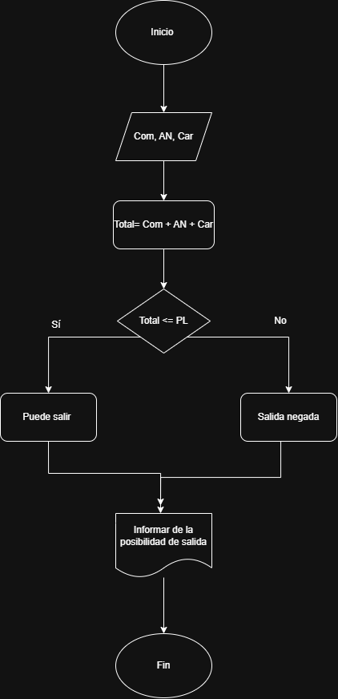

# Actividad

## 1. **Verificación de peso de despegue**
    
 **En una pista de pruebas de aeronaves, el sistema debe verificar si el peso total de la aeronave, incluyendo combustible y carga, supera el límite máximo permitido para el despegue. Dependiendo del resultado, el sistema deberá indicar si la aeronave está lista para despegar o si debe reducir carga o combustible.**

---

## 2. **Control de temperatura del motor**
    
 **Durante una inspección de rutina, se mide la temperatura de un motor de turbina. Si la temperatura es mayor a un valor crítico, se debe indicar "Peligro: sobrecalentamiento". Si está dentro del rango seguro, indicar "Operación normal". Si es demasiado baja, indicar "Motor frío – Calentar antes de operar".**

**Valores de entrada**

|dato|Descripción|
|----|-----------|
|Temp|Temperatura actual del motor|
|Crit|Valor crítico máximo permitido|
|Min|Valor mínimo permitido para operación|

**Valores de salida**

|dato|Descripción|
|-|-|
|Men|Estado del motor (Sobrecalentamiento, Operación normal o Motor frío)|

**Valores intermedios**

|dato|Descripción|
|-|-|
|Est|Clasificación según la temperatura medida|

---

### pseudocodigo

Inicio

Leer Temp

 si

    Est < Crit

    mostrar "Peligro: sobrecalentamiento"

 si no

    si

        si 

        Est > Min

        mostrar "Motor frío – Calentar antes de operar"

    si no

     mostrar "Operación normal"

finsi

fin 

---

## 3 **Registro de altitudes de vuelo**
    
**Un sistema debe registrar la altitud de vuelo cada 10 minutos durante una hora y mostrar todas las mediciones al final.**

**Valores de entrada**

|dato|Descripción|
|----|-----------|
|Alt|Altitud registrada cada 10 minutos|
|i|Contador de registros (1 a 6)|

**Valores de salida**

|dato|Descripción|
|-|-|
|Alt1–Alt6|Lista de las altitudes registradas|
|Reporte|Visualización final de todas las mediciciones|

**Valores intermedios**

|dato|Descripción|
|-|-|
|TotalReg|Cantidad total de registros realizados (6 en una hora)|

---

---

## 4. **Control de combustible en pruebas**
    
**Durante un ensayo en banco de un motor a reacción, se mide el nivel de combustible cada minuto y se detiene el registro cuando el combustible baja del 10%. Mostrar el tiempo total de operación antes de llegar a ese punto.**

### Valor de entrada
| dato | Descripción                        |
| ---- | ---------------------------------- |
| Comb | Nivel de combustible en porcentaje |
|Can.comb|cantidad max del tanque de combustible|

### Valor de salida
| dato   | Descripción                          |
| ------ | ------------------------------------ |
| Tiempo | Tiempo total de operación en minutos |

### Valor intermedio
| dato | Descripción                                  |
| ---- | -------------------------------------------- |
| Lim  | Límite mínimo permitido de combustible (10%) |
|Por.com|porcentaje de combustible|

---

### pseudocodigo

inicio

Lim = 10 

Tiempo = 0

mostrar "Ingrese el cantidad max combustible"

Leer Can.comb

leer Comb

 
    pro.com = Comb * 100 / Can.comb = pro.com

mientras por.com >= Comb * 100 / Can.comb = 10

    Tiempo = Tiempo + 1

    leer Comb

    pro.com = Comb * 100 / Can.comb = pro.com

fin mientras

mostrar "El tiempo total de operación antes de bajar del 10% fue:"
mostrar Tiempo
mostrar "minutos"

fin

## 5. **Control de temperatura en cabina**
    
**Un sistema mide cada 5 minutos la temperatura en cabina durante una hora. Si en algún momento se detecta una temperatura mayor a 27°C o menor a 18°C, debe indicar que se active el sistema de climatización.**

**Valores de entrada**

|dato|Descripción|
|----|-----------|
|Temp|Temperatura medida en cabina|
|i|Contador de mediciones (cada 5 minutos)|
|LimSup|Límite superior permitido (27°C)|
|LimInf|Límite inferior permitido (18°C)|

**Valores de salida**

|dato|Descripción|
|-|-|
|Mensaje|Indica si se debe activar el sistema de climatización|
|Reporte|Resumen final de las mediciones realizadas|

**Valores intermedios**

|dato|Descripción|
|-|-|
|Activado|Variable que indica si se activó el sistema de climatización|
|TotalMed|Cantidad total de mediciones realizadas (12 en una hora)|

---